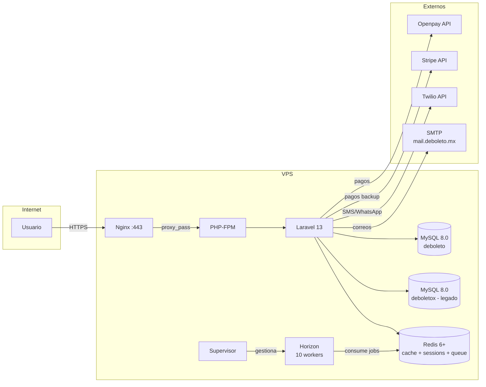

# Guía de Despliegue — DeBoletoMX v2

> Documento de referencia para el despliegue de DeBoletoMX v2 en un VPS con Ubuntu,
> Nginx, PHP-FPM, MySQL, Redis y Horizon.

---

## Índice

1. [Prerrequisitos del Servidor](#1-prerrequisitos-del-servidor)
2. [Arquitectura de Producción](#2-arquitectura-de-producción)
3. [Preparación Inicial del Servidor](#3-preparación-inicial-del-servidor)
4. [Configurar la Base de Datos](#4-configurar-la-base-de-datos)
5. [Configurar Redis](#5-configurar-redis)
6. [Clonar y Configurar la Aplicación](#6-clonar-y-configurar-la-aplicación)
7. [Instalar Dependencias y Build](#7-instalar-dependencias-y-build)
8. [Optimizaciones de Laravel](#8-optimizaciones-de-laravel)
9. [Configurar Nginx](#9-configurar-nginx)
10. [SSL con Let's Encrypt](#10-ssl-con-lets-encrypt)
11. [Configurar Queue Workers (Horizon)](#11-configurar-queue-workers-horizon)
12. [Configurar el Scheduler (Cron)](#12-configurar-el-scheduler-cron)
13. [Storage y Archivos Estáticos](#13-storage-y-archivos-estáticos)
14. [Servicios Externos](#14-servicios-externos)
15. [Webhooks — CSRF Exemption](#15-webhooks--csrf-exemption)
16. [Firewall y Seguridad](#16-firewall-y-seguridad)
17. [Estrategia de Backups](#17-estrategia-de-backups)
18. [Procedimiento de Deploy Paso a Paso](#18-procedimiento-de-deploy-paso-a-paso)
19. [Post-Deploy — Verificación](#19-post-deploy--verificación)
20. [Monitoreo](#20-monitoreo)
21. [Rollback](#21-rollback)
22. [Solución de Problemas Comunes](#22-solución-de-problemas-comunes)

---

## 1. Prerrequisitos del Servidor

| Componente | Versión Mínima | Notas |
|---|---|---|
| SO | Ubuntu 22.04 / 24.04 LTS | x86_64 |
| PHP | 8.3+ | Con FPM y extensiones listadas abajo |
| MySQL | 8.0+ | Motor InnoDB, charset utf8mb4 |
| Redis | 6.0+ | Para cache, sesiones, colas y Horizon |
| Node.js | 20 LTS+ | Solo para build de assets (no en producción runtime) |
| Composer | 2.x | PHP package manager |
| Nginx | 1.24+ | Servidor web |
| Supervisor | 4.x | Para gestionar Horizon como servicio |
| Git | 2.x | Control de versiones |

### Extensiones PHP Requeridas

```bash
apt install -y php8.3-fpm php8.3-cli php8.3-common php8.3-mysql \
  php8.3-redis php8.3-xml php8.3-mbstring php8.3-curl php8.3-gd \
  php8.3-bcmath php8.3-zip php8.3-tokenizer php8.3-json \
  php8.3-fileinfo php8.3-ctype php8.3-dom php8.3-posix php8.3-pcntl
```

> **Nota:** `ext-pcntl` y `ext-posix` están declarados en `composer.json` como
> requeridos por la plataforma. En Windows no existen, en Linux deben instalarse.

---

## 2. Arquitectura de Producción



### Notas de Arquitectura

- **Base de datos compartida:** La aplicación se conecta a la base `deboleto`
  (datos nuevos) y lee de `deboletox` (sistema legado) a través del comando
  `events:sync-search`, que consulta la vista `view_eventos` de la DB heredada.
- **Redis centralizado:** Un solo Redis maneja cache (`CACHE_STORE=redis`),
  sesiones (`SESSION_DRIVER=redis`), colas (`QUEUE_CONNECTION=redis`) y
  métricas de Horizon.
- **Sin equipos:** Jetstream está configurado sin teams, sin API, sin fotos de
  perfil. Solo ofrece autenticación + 2FA + eliminación de cuenta.

---

## 3. Preparación Inicial del Servidor

```bash
# Actualizar sistema
apt update && apt upgrade -y

# Instalar stack LEMP
apt install -y nginx mysql-server redis-server supervisor git curl wget unzip

# Instalar PHP 8.3 + extensiones
add-apt-repository -y ppa:ondrej/php
apt update
apt install -y php8.3-fpm php8.3-cli php8.3-mysql php8.3-redis \
  php8.3-xml php8.3-mbstring php8.3-curl php8.3-gd php8.3-bcmath \
  php8.3-zip php8.3-tokenizer php8.3-json php8.3-fileinfo php8.3-ctype \
  php8.3-dom php8.3-posix php8.3-pcntl

# Instalar Composer
php -r "copy('https://getcomposer.org/installer', 'composer-setup.php');"
php composer-setup.php --install-dir=/usr/local/bin --filename=composer
php -r "unlink('composer-setup.php');"

# Instalar Node.js 20 LTS
curl -fsSL https://deb.nodesource.com/setup_20.x | bash -
apt install -y nodejs
```

### Tuning de PHP-FPM

Editar `/etc/php/8.3/fpm/pool.d/www.conf`:

```ini
pm = dynamic
pm.max_children = 50
pm.start_servers = 5
pm.min_spare_servers = 5
pm.max_spare_servers = 15
pm.max_requests = 500
```

```bash
systemctl restart php8.3-fpm
```

---

## 4. Configurar la Base de Datos

### Opción A — Migraciones de Laravel (recomendada)

```bash
mysql -u root -p
```

```sql
CREATE DATABASE IF NOT EXISTS deboleto
  CHARACTER SET utf8mb4
  COLLATE utf8mb4_unicode_ci;

CREATE USER 'deboleto'@'localhost' IDENTIFIED BY 'password_seguro';
GRANT ALL PRIVILEGES ON deboleto.* TO 'deboleto'@'localhost';

-- La DB legada deboletox debe existir y ser accesible:
-- GRANT SELECT ON deboletox.* TO 'deboleto'@'localhost';

FLUSH PRIVILEGES;
```

Luego en la aplicación:

```bash
php artisan migrate --force
php artisan db:seed --force
```

### Opción B — DDL Manual

Si prefieres crear las tablas directamente, ejecuta el script completo en
`docs/database-erd.sql`. Este script incluye:

- **13 tablas existentes** (Laravel + Jetstream + Spatie) con `IF NOT EXISTS`
- **13 tablas de negocio nuevas:** `categorias`, `lugares`, `eventos`,
  `evento_imagenes`, `zonas`, `compras`, `boletos`, `puntos_venta`,
  `evento_punto_venta`, `wishlists`, `pago_metodos`, `carritos`,
  `token_recuperacion`
- **Índices adicionales** para performance

```bash
mysql -u deboleto -p deboleto < docs/database-erd.sql
```

> **Importante:** La DB `deboletox` del sistema legado debe existir en el mismo
> servidor MySQL o ser accesible desde la configuración de conexión. El comando
> `events:sync-search` lee de `deboletox.view_eventos`.

---

## 5. Configurar Redis

```bash
systemctl enable redis-server
systemctl start redis-server
```

Verificar que Redis esté escuchando solo en localhost:

```bash
ss -tlnp | grep 6379
# debería mostrar 127.0.0.1:6379
```

Si se requiere contraseña, editar `/etc/redis/redis.conf`:

```
requirepass tu_password_seguro
```

```bash
systemctl restart redis-server
```

---

## 6. Clonar y Configurar la Aplicación

```bash
# Crear directorio
mkdir -p /var/www/deboleto
cd /var/www/deboleto

# Clonar repositorio
git clone <url-del-repositorio> .

# Permisos de directorios
chown -R www-data:www-data /var/www/deboleto
chmod -R 775 storage bootstrap/cache public/events public/build

# Configurar .env
cp .env.example .env
nano .env   # Editar con valores de producción
```

### Variables de Entorno — Producción

| Variable | Valor Ejemplo | Notas |
|---|---|---|
| `APP_ENV` | `production` | |
| `APP_DEBUG` | `false` | |
| `APP_URL` | `https://deboleto.mx` | Con HTTPS |
| `APP_KEY` | (generado) | Ejecutar `php artisan key:generate` |
| `APP_LOCALE` | `es` | |
| `APP_FALLBACK_LOCALE` | `es` | |
| `DB_HOST` | `127.0.0.1` | |
| `DB_DATABASE` | `deboleto` | |
| `DB_USERNAME` | `deboleto` | |
| `DB_PASSWORD` | `***` | |
| `REDIS_HOST` | `127.0.0.1` | |
| `REDIS_PASSWORD` | `null` o el configurado | |
| `CACHE_STORE` | `redis` | |
| `SESSION_DRIVER` | `redis` | |
| `SESSION_LIFETIME` | `120` | |
| `QUEUE_CONNECTION` | `redis` | |
| `MAIL_MAILER` | `smtp` | |
| `MAIL_HOST` | `mail.deboleto.mx` | |
| `MAIL_FROM_ADDRESS` | `no-reply@deboleto.mx` | |
| `STRIPE_KEY` | `pk_live_***` | |
| `STRIPE_SECRET` | `sk_live_***` | |
| `OPENPAY_MERCHANT_ID` | `m***` | |
| `OPENPAY_PRIVATE_KEY` | `sk_***` | |
| `OPENPAY_PUBLIC_KEY` | `pk_***` | |
| `OPENPAY_PRODUCTION` | `true` | |
| `TWILIO_SID` | `AC***` | |
| `TWILIO_TOKEN` | `***` | |
| `TWILIO_FROM` | `+52***` | |
| `TWILIO_WHATSAPP_FROM` | `+14155238886` | Número de Twilio para WhatsApp |
| `VITE_APP_NAME` | `"${APP_NAME}"` | |

```bash
php artisan key:generate
```

---

## 7. Instalar Dependencias y Build

```bash
# PHP — solo dependencias de producción
composer install --optimize-autoloader --no-dev

# Node.js — .npmrc ya tiene ignore-scripts=true
npm install

# Build de assets con Vite 8
npm run build
```

> El build genera los archivos compilados en `public/build/` (JS, CSS, y
> manifiesto de Vite).

---

## 8. Optimizaciones de Laravel

Ejecutar en orden:

```bash
php artisan storage:link
php artisan config:cache
php artisan route:cache
php artisan view:cache
php artisan event:cache
```

> **Nota:** El health endpoint `/up` ya está registrado en `bootstrap/app.php`
> (línea 13). Laravel lo usa para health checks de balanceadores.

---

## 9. Configurar Nginx

Crear `/etc/nginx/sites-available/deboleto`:

```nginx
server {
    listen 80;
    server_name deboleto.mx www.deboleto.mx;
    return 301 https://$server_name$request_uri;
}

server {
    listen 443 ssl http2;
    server_name deboleto.mx www.deboleto.mx;

    root /var/www/deboleto/public;
    index index.php;

    # SSL (configurar después con Certbot)
    ssl_certificate /etc/letsencrypt/live/deboleto.mx/fullchain.pem;
    ssl_certificate_key /etc/letsencrypt/live/deboleto.mx/privkey.pem;
    ssl_protocols TLSv1.2 TLSv1.3;
    ssl_ciphers ECDHE-ECDSA-AES128-GCM-SHA256:ECDHE-RSA-AES128-GCM-SHA256;
    ssl_prefer_server_ciphers on;

    # Security headers
    add_header X-Frame-Options "SAMEORIGIN" always;
    add_header X-Content-Type-Options "nosniff" always;
    add_header X-XSS-Protection "1; mode=block" always;
    add_header Strict-Transport-Security "max-age=31536000; includeSubDomains" always;
    add_header Referrer-Policy "strict-origin-when-cross-origin" always;

    # Tamaños máximos
    client_max_body_size 20M;

    # Compresión
    gzip on;
    gzip_types text/plain text/css application/json application/javascript
               image/svg+xml image/webp;
    gzip_min_length 256;

    # Assets estáticos — cache largo
    location /build/ {
        expires 1y;
        add_header Cache-Control "public, immutable";
        access_log off;
    }

    location /events/ {
        expires 7d;
        add_header Cache-Control "public, immutable";
        access_log off;
    }

    location /storage/ {
        expires 7d;
        add_header Cache-Control "public, immutable";
        access_log off;
    }

    # Robots y favicon
    location = /robots.txt { access_log off; log_not_found off; }
    location = /favicon.ico { access_log off; log_not_found off; }

    # Horizon dashboard — protegido con autenticación básica
    location /horizon {
        auth_basic "Acceso restringido";
        auth_basic_user_file /etc/nginx/.horizon_passwd;
        try_files $uri /index.php?$query_string;
    }

    # Inertia SPA — todas las rutas al front controller
    location / {
        try_files $uri $uri/ /index.php?$query_string;
    }

    location ~ \.php$ {
        fastcgi_pass unix:/var/run/php/php8.3-fpm.sock;
        fastcgi_param SCRIPT_FILENAME $document_root$fastcgi_script_name;
        include fastcgi_params;
        fastcgi_buffer_size 128k;
        fastcgi_buffers 4 256k;
        fastcgi_busy_buffers_size 256k;
    }

    # Denegar acceso a archivos ocultos
    location ~ /\.(?!well-known) {
        deny all;
        access_log off;
        log_not_found off;
    }
}
```

Activar el sitio:

```bash
ln -s /etc/nginx/sites-available/deboleto /etc/nginx/sites-enabled/
rm -f /etc/nginx/sites-enabled/default
nginx -t
systemctl reload nginx
```

### Proteger Horizon con Basic Auth

```bash
apt install -y apache2-utils
htpasswd -c /etc/nginx/.horizon_passwd admin
```

---

## 10. SSL con Let's Encrypt

```bash
apt install -y certbot python3-certbot-nginx

certbot --nginx -d deboleto.mx -d www.deboleto.mx

# Verificar renovación automática
certbot renew --dry-run
```

El certificado se renovará automáticamente vía systemd timer.

---

## 11. Configurar Queue Workers (Horizon)

La aplicación usa **Laravel Horizon** para gestionar las colas. La configuración
de producción ya está definida en `config/horizon.php`:

```php
'production' => [
    'supervisor-1' => [
        'maxProcesses' => 10,
        'balanceMaxShift' => 1,
        'balanceCooldown' => 3,
    ],
],
```

### Supervisor

Crear `/etc/supervisor/conf.d/horizon.conf`:

```ini
[program:horizon]
process_name=%(program_name)s
command=php /var/www/deboleto/artisan horizon
autostart=true
autorestart=true
user=www-data
redirect_stderr=true
stdout_logfile=/var/www/deboleto/storage/logs/horizon.log
stopwaitsecs=3600
```

```bash
supervisorctl reread
supervisorctl update
supervisorctl start horizon
```

### Fast Termination (Recomendado)

Para deploys más rápidos, cambiar en `config/horizon.php`:

```php
'fast_termination' => true,
```

Esto permite que un nuevo proceso de Horizon inicie mientras el anterior
termina sus workers gradualmente.

### Comandos Útiles de Gestión

```bash
supervisorctl status horizon
supervisorctl restart horizon
tail -f /var/www/deboleto/storage/logs/horizon.log
php artisan horizon:status
php artisan queue:failed-table
php artisan queue:retry all
```

---

## 12. Configurar el Scheduler (Cron)

Laravel requiere una sola entrada en crontab para ejecutar el scheduler:

```bash
crontab -e -u www-data
```

```
* * * * * cd /var/www/deboleto && php artisan schedule:run >> /dev/null 2>&1
```

### Tareas a Programar

Actualmente no hay tareas definidas en `routes/console.php`. Agregar las
siguientes al archivo `routes/console.php`:

```php
use Illuminate\Support\Facades\Schedule;

Schedule::command('events:sync-search')->everyMinute();
Schedule::command('horizon:snapshot')->everyFiveMinutes();
```

- `events:sync-search` — Sincroniza eventos desde MySQL a Redis (clave
  `eventos_activos_app`) para búsqueda rápida. Lee de `view_eventos` (legado)
  con fallback a tabla `eventos`.
- `horizon:snapshot` — Toma métricas para los gráficos del dashboard de
  Horizon.

---

## 13. Storage y Archivos Estáticos

### Enlace Simbólico

```bash
php artisan storage:link
# Crea public/storage → storage/app/public
```

### Directorios con Permisos de Escritura

| Directorio | Propósito |
|---|---|
| `storage/framework/cache/data/` | Cache de Laravel |
| `storage/framework/sessions/` | Fallback de sesiones (si no usa Redis) |
| `storage/framework/views/` | Vistas Blade compiladas |
| `storage/logs/` | Logs de aplicación |
| `public/events/` | Imágenes de eventos |
| `public/build/` | Assets compilados por Vite |

```bash
chown -R www-data:www-data storage bootstrap/cache public/events public/build
```

### Scripts de Utilidad

```bash
# Optimizar imágenes PNG a WebP/AVIF
node scripts/optimize-images.mjs

# Regenerar OG image
node scripts/generate-og.mjs
```

---

## 14. Servicios Externos

| Servicio | Variables | Modo Producción | Verificación Post-Deploy |
|---|---|---|---|
| **Openpay** | `OPENPAY_MERCHANT_ID`, `OPENPAY_PRIVATE_KEY`, `OPENPAY_PUBLIC_KEY` | `OPENPAY_PRODUCTION=true` | Realizar compra de prueba con tarjeta real |
| **Stripe** (backup) | `STRIPE_KEY`, `STRIPE_SECRET` | Usar claves `live_` | Probar webhook con CLI de Stripe |
| **Twilio** | `TWILIO_SID`, `TWILIO_TOKEN`, `TWILIO_FROM`, `TWILIO_WHATSAPP_FROM` | Claves del proyecto live | Enviar SMS/WhatsApp de prueba |
| **SMTP** | `MAIL_HOST`, `MAIL_USERNAME`, `MAIL_PASSWORD`, `MAIL_FROM_ADDRESS` | `MAIL_ENCRYPTION=tls`, puerto 587 | Enviar correo de prueba |
| **Search Console** | — | Verificar dominio vía DNS TXT | Enviar sitemap |

---

## 15. Webhooks — CSRF Exemption

Los webhooks de Openpay y Stripe llegan como POST sin cookie de sesión. Deben
excluirse del middleware CSRF. En `bootstrap/app.php`:

```php
->withMiddleware(function (Middleware $middleware): void {
    $middleware->api(prepend: [
        \App\Http\Middleware\HandleInertiaRequests::class,
        \Illuminate\Http\Middleware\AddLinkHeadersForPreloadedAssets::class,
    ]);

    $middleware->validateCsrfTokens(except: [
        'api/webhooks/openpay',
        'api/webhooks/stripe',
    ]);
})
```

> **Nota:** Las rutas exactas de webhook dependen de la implementación actual
> en los módulos `app/Modules/Payments/`. Ajustar según sea necesario.

---

## 16. Firewall y Seguridad

### UFW

```bash
ufw default deny incoming
ufw default allow outgoing
ufw allow 22/tcp    # SSH
ufw allow 80/tcp    # HTTP
ufw allow 443/tcp   # HTTPS
ufw enable
```

### Hardening de PHP

Editar `/etc/php/8.3/fpm/php.ini`:

```ini
expose_php = Off
disable_functions = exec, system, shell_exec, passthru, proc_open, popen
display_errors = Off
log_errors = On
error_reporting = E_ALL & ~E_DEPRECATED & ~E_STRICT
date.timezone = America/Mexico_City
```

### fail2ban (Recomendado)

```bash
apt install -y fail2ban
systemctl enable fail2ban
```

---

## 17. Estrategia de Backups

### Backup Diario de Base de Datos

Ubicar en `/etc/cron.daily/deboleto-db-backup`:

```bash
#!/bin/bash
BACKUP_DIR="/var/backups/deboleto/db"
mkdir -p "$BACKUP_DIR"
mysqldump -u deboleto -p'password' deboleto \
  | gzip > "$BACKUP_DIR/deboleto-$(date +%Y%m%d).sql.gz"
find "$BACKUP_DIR" -name "*.sql.gz" -mtime +30 -delete
```

```bash
chmod +x /etc/cron.daily/deboleto-db-backup
```

### Backup de Archivos

Ubicar en `/etc/cron.daily/deboleto-files-backup`:

```bash
#!/bin/bash
BACKUP_DIR="/var/backups/deboleto/files"
mkdir -p "$BACKUP_DIR"
tar czf "$BACKUP_DIR/deboleto-files-$(date +%Y%m%d).tar.gz" \
  /var/www/deboleto/storage/app/public \
  /var/www/deboleto/public/events \
  /var/www/deboleto/.env
find "$BACKUP_DIR" -name "*.tar.gz" -mtime +30 -delete
```

### Backup Remoto (Opcional)

Usar `rsync` para enviar backups a un servidor externo o bucket S3.

---

## 18. Procedimiento de Deploy Paso a Paso

### Script de Deploy Manual

Ejecutar localmente o vía SSH:

```bash
#!/bin/bash
set -e

APP_DIR="/var/www/deboleto"
REMOTE="usuario@deboleto.mx"

echo "=== Deploy DeBoletoMX ==="

# 1. Pausar el scheduler (evita tareas durante el deploy)
ssh "$REMOTE" "cd $APP_DIR && php artisan schedule:interrupt"

# 2. Modo maintenance
ssh "$REMOTE" "cd $APP_DIR && php artisan down --retry=60"

# 3. Pull del código
ssh "$REMOTE" "cd $APP_DIR && git pull origin main"

# 4. Dependencias PHP
ssh "$REMOTE" "cd $APP_DIR && composer install --optimize-autoloader --no-dev --no-interaction"

# 5. Build de assets (local o remoto)
ssh "$REMOTE" "cd $APP_DIR && npm ci --ignore-scripts && npm run build"

# 6. Migraciones
ssh "$REMOTE" "cd $APP_DIR && php artisan migrate --force"

# 7. Optimizaciones
ssh "$REMOTE" "cd $APP_DIR && php artisan config:cache && php artisan route:cache && php artisan view:cache && php artisan event:cache"

# 8. Reiniciar workers (graceful)
ssh "$REMOTE" "cd $APP_DIR && php artisan horizon:terminate"
sleep 2
ssh "$REMOTE" "sudo supervisorctl start horizon"

# 9. Salir de maintenance
ssh "$REMOTE" "cd $APP_DIR && php artisan up"

# 10. Smoke test
sleep 3
curl -sI https://deboleto.mx | head -n 1
curl -s https://deboleto.mx/up

echo "=== Deploy completado ==="
```

### Smoke Test Post-Deploy

```bash
# Verificar que responde 200
curl -sI https://deboleto.mx | grep "HTTP"

# Verificar health check
curl -s https://deboleto.mx/up

# Verificar que Horizon está activo
php artisan horizon:status

# Verificar colas
php artisan queue:failed | head -5
```

---

## 19. Post-Deploy — Verificación

Checklist obtenido de `docs/NEXT-STEPS.md`:

- [ ] **Google Search Console** — Verificar dominio (TXT DNS), enviar
      `/sitemap.xml`, monitorear cobertura de indexación
- [ ] **Rich Results Test** — Validar schemas Organization, WebSite, Event,
      BreadcrumbList
- [ ] **Lighthouse** — SEO ≥90, LCP <2.5s, CLS <0.1
- [ ] **Open Graph Debugger** — Verificar título, descripción e imagen social
- [ ] **Server-rendered HTML** — `curl -H "User-Agent: Googlebot" https://deboleto.mx`
      debe devolver HTML completo (no solo `<div id="app">`)
- [ ] **Pago con Openpay** — Probar flujo completo con tarjeta real
- [ ] **Pago con Stripe** — Probar flujo de respaldo
- [ ] **SMS/WhatsApp** — Verificar entrega de Twilio
- [ ] **Correo** — Verificar entregabilidad SPF/DKIM
- [ ] **Sitemap** — Acceder a `/sitemap.xml`

---

## 20. Monitoreo

### Horizon Dashboard

Acceder en `https://deboleto.mx/horizon` (protegido con basic auth). Muestra:

- Estado de workers y colas
- Jobs recientes y fallidos
- Métricas de rendimiento
- Tiempos de espera por cola

### Logs

| Archivo | Propósito | Rotación |
|---|---|---|
| `storage/logs/laravel.log` | Log general de la aplicación | Diaria (LOG_CHANNEL=daily) |
| `storage/logs/horizon.log` | Salida de Horizon | Administrada por Supervisor |

### Activity Log (Spatie)

Retención configurada a 365 días en `config/activitylog.php`.

### Comandos de Monitoreo

```bash
# Estado de workers
php artisan horizon:status

# Jobs fallidos
php artisan queue:failed-table

# Reintentar jobs fallidos
php artisan queue:retry all

# Ver métricas de Redis
redis-cli INFO stats

# Ver tamaño de colas
redis-cli LLEN queues:default
redis-cli LLEN queues:emails
redis-cli LLEN queues:tickets
```

---

## 21. Rollback

### Rollback Rápido (código)

```bash
cd /var/www/deboleto
git revert HEAD --no-edit
php artisan horizon:terminate
sudo supervisorctl start horizon
php artisan up
```

### Rollback de Migración

```bash
php artisan migrate:rollback --step=1 --force
php artisan config:cache
php artisan route:cache
php artisan view:cache
```

### Rollback Completo (restaurar backup)

```bash
# Detener la aplicación
php artisan down

# Restaurar código
git reset --hard <commit-anterior>

# Restaurar base de datos
gunzip -c /var/backups/deboleto/db/deboleto-20260101.sql.gz | mysql -u deboleto -p deboleto

# Restaurar archivos
tar xzf /var/backups/deboleto/files/deboleto-files-20260101.tar.gz -C /

# Reconstruir cache
composer install --optimize-autoloader --no-dev
npm run build
php artisan config:cache
php artisan route:cache
php artisan view:cache
php artisan horizon:terminate
sudo supervisorctl start horizon

# Reanudar
php artisan up
```

---

## 22. Solución de Problemas Comunes

| Problema | Causa Posible | Solución |
|---|---|---|
| Error 503 en deploy | `php artisan down` activo | Ejecutar `php artisan up` |
| Error 419 en formularios | CSRF token inválido | Limpiar cookies o verificar `SESSION_DRIVER` |
| Error 500 después de cache | Cache desactualizado | `php artisan config:clear && php artisan route:clear && php artisan view:clear` |
| Horizon no inicia | Redis no disponible | Verificar `redis-cli ping` y credenciales en `.env` |
| Jobs no se ejecutan | Worker detenido | `supervisorctl status` y `supervisorctl restart horizon` |
| `view_eventos` no existe | DB legada no configurada | Verificar que `deboletox` existe y es accesible con el mismo usuario |
| Imágenes no cargan | Enlace simbólico faltante | `php artisan storage:link` |
| Build de Vite falla | Versión de Node.js incorrecta | Verificar `node -v` ≥20 |
| Error de permisos en storage | www-data no es dueño | `chown -R www-data:www-data storage bootstrap/cache` |
| Openpay rechaza cargo | Modo producción desactivado | Verificar `OPENPAY_PRODUCTION=true` y llaves live |
| Webhook no recibido | CSRF bloqueando | Verificar `except` en `bootstrap/app.php` |

---

> **Documentos Relacionados:**
> - `docs/NEXT-STEPS.md` — Checklist post-deploy detallado
> - `docs/database-erd.md` — Diagrama entidad-relación
> - `docs/database-erd.sql` — DDL completo de la base de datos
> - `docs/CRUD-PRIORITY.md` — Plan de construcción de módulos
> - `config/horizon.php` — Configuración de workers
> - `.env.example` — Template de variables de entorno
